# Polyglot Codebase Knowledge Graph

> Generated offline by **readmenator**. 3 files, 45 symbols, 19 imports. Supports C, C++, Python, Go, Rust, JS/TS, Java, C#, Shell, PHP, Dart, GDScript, Nim, ASM, Ruby, Swift, Kotlin, Scala, Lua, Elixir.
> No LLMs. No tokens. Pure static analysis. See more [here](https://github.com/grisuno/ReadMenator)

**Start here:** Statistics Dashboard for scope, God Nodes for blast radius, Architecture Reference for per-file API. Agents: prefer `readmenator-agent/INDEX.md` + `SYMBOLS.md`.

**Wiki:** prefer `readmenator-wiki/index.md` for progressive disclosure: one synthesis page per community, `connections.json` with EXTRACTED vs INFERRED confidence, `queries.md` log, `REPORT.md` audit.

**Confidence:** EXTRACTED = parsed from source, INFERRED = heuristic bridge, AMBIGUOUS = reported, never hidden. See `readmenator-wiki/REPORT.md`.

**Total Files Parsed:** 3 | **Total Symbols Extracted:** 45 | **Total Imports:** 19

<!-- ranking_model: v1.0 | weights: {ppr:0.45,auth:0.2,test:0.15,doc:0.1,fresh:0.1} | alpha:0.85 | commit:05a4468 | date:2026-07-18 -->


## Table of Contents

1. [Statistics Dashboard](#statistics-dashboard)
2. [Architectural Layers](#architectural-layers)
3. [Ranked Context](#ranked-context)
4. [God Nodes](#god-nodes)
5. [Suggested Questions](#suggested-questions)
6. [Hotspot Analysis](#hotspot-analysis)
7. [Change Impact Analysis](#change-impact-analysis)
8. [Suggested Linting Rules](#suggested-linting-rules)
9. [Orphans](#orphans)
10. [Query Recipes](#query-recipes)
11. [Structural Knowledge Map](#structural-knowledge-map)
12. [UML Class Diagram](#uml-class-diagram)
13. [Code Property Graph](#code-property-graph)
14. [Architecture Reference](#architecture-reference)
    - [PY (2 files)](#py-2-files)
    - [SH (1 files)](#sh-1-files)

---

## Statistics Dashboard

| Metric | Value |
|--------|-------|
| Total Files | 3 |
| Total Symbols | 45 |
| Total Imports | 19 |
| Call Edges | 460 |
| Inheritance Edges | 9 |
| Languages | 2 |
| Avg Symbols/File | 15.0 |
| Avg Imports/File | 6.3 |

### Top Files by Import Count (Fan-Out)

| File | Imports | Symbols | Language |
|------|---------|---------|----------|
| `topobrain_fusion.py` | 11 | 25 | py |
| `app.py` | 8 | 20 | py |

---

## Architectural Layers

Auto-detected from path patterns, naming conventions, and imported frameworks.

| Layer | Files |
|-------|-------|
| utility | 3 |

### utility

- `app.py` (py, 20 symbols)
- `install.sh` (sh, 0 symbols)
- `topobrain_fusion.py` (py, 25 symbols)

---

## Ranked Context

Files ranked by composite score for the current query context. The ranking combines Personalized PageRank (query relevance), global authority, test coverage, documentation coverage, and code freshness. Model: v1.0.

| Rank | File | Composite | PPR | Authority | Test | Doc |
|------|------|-----------|-----|-----------|------|-----|
| 1 | `topobrain_fusion.py` | 0.0280 | 0.0000 | 0.0000 | 0.00 | 0.28 |
| 2 | `app.py` | 0.0200 | 0.0000 | 0.0000 | 0.00 | 0.20 |
| 3 | `install.sh` | 0.0000 | 0.0000 | 0.0000 | 0.00 | 0.00 |

---

## God Nodes

Most architecturally central files ranked by combined import/export degree and symbol richness.

| File | Score | Connections | PageRank |
|------|-------|-------------|----------|
| `topobrain_fusion.py` | 2.5 | | 0.0000 |
| `app.py` | 2.0 | | 0.0000 |
| `install.sh` | 0.0 | | 0.0000 |

---

## Suggested Questions

Auto-generated exploration prompts based on graph structure:

- What does topobrain_fusion.py depend on, and what depends on it? (0 connections)
- What does app.py depend on, and what depends on it? (0 connections)
- What does install.sh depend on, and what depends on it? (0 connections)
- What is Config in app.py and how is it used?
- What is Config in topobrain_fusion.py and how is it used?

---

## Hotspot Analysis

Files ranked by combined complexity (symbol count) and centrality (connection count). High-scoring files are architecturally critical and may need refactoring attention.

| File | Complexity | Centrality | Combined | Symbols | Connections |
|------|-----------|------------|----------|---------|-------------|
| `topobrain_fusion.py` | 1.000 | 1.000 | 1.000 | 25 | 11 |
| `app.py` | 0.800 | 0.727 | 0.756 | 20 | 8 |
| `install.sh` | 0.000 | 0.000 | 0.000 | 0 | 0 |

---

## Change Impact Analysis

Files sorted by how many other files would be affected if they changed. High-impact files should be changed with caution.

| File | Direct Dependents | Transitive Dependents | Total Impact |
|------|------------------|----------------------|--------------|
| `app.py` | 0 | 0 | 0 |
| `install.sh` | 0 | 0 | 0 |
| `topobrain_fusion.py` | 0 | 0 | 0 |

---

## Suggested Linting Rules

Automatically suggested linting and security rules based on patterns detected in the codebase. These can be exported as Semgrep rules using the `--export-rules` flag.

| Rule ID | Severity | Description | Language | Matches |
|---------|----------|-------------|----------|---------|
| `RM001` | info | Large number of functions in py: 34 total | py | 34 |
| `RM002` | info | Print statement found (consider logging instead) | python | 69 |

---

## Orphans

Files with no documentation or low connectivity. These are candidates for documentation investment or cleanup.

- `install.sh` (0 symbols, no doc)

---

## Query Recipes

Example queries you can run against this knowledge base using the ranking engine:

```
# Find files most relevant to a concept
readmenator query "Where is the import resolver implemented?"

# Rank files by relevance to a topic
readmenator query "How does documentation generation work?"

# Explain why a file ranks highly
readmenator query "explain readmenator/_documentation.py"

# Trace dependency paths with ranked context
readmenator query "path from CLI to exporter"
```

The ranking model uses the following signals:

- **Personalized PageRank** (45% weight): query-specific relevance via seed propagation
- **Global Authority** (20% weight): structural importance via standard PageRank
- **Test Coverage** (15% weight): fraction of symbols referenced in test files
- **Doc Coverage** (10% weight): presence of docstrings and file-level docs
- **Freshness** (10% weight): recent modification activity

Results include score decomposition and justification paths for each ranked item.

---

## Structural Knowledge Map

```mermaid
graph TD
    classDef mod fill:#1e1e1e,stroke:#ff6666,stroke-width:2px,color:#fff;
    classDef cls fill:#2d2d2d,stroke:#4ec9b0,stroke-width:2px,color:#fff;
    classDef fn fill:#333,stroke:#dcdcaa,stroke-width:1px,color:#dcdcaa;
    classDef ext fill:#111,stroke:#666,stroke-dasharray:5 5,color:#aaa;
    topobrain_fusion_py["topobrain_fusion.py (py)"]
    class topobrain_fusion_py mod;
    topobrain_fusion_py_Config["Config"]
    class topobrain_fusion_py_Config cls;
    topobrain_fusion_py --> topobrain_fusion_py_Config
    topobrain_fusion_py_CyclotronDataset["CyclotronDataset"]
    class topobrain_fusion_py_CyclotronDataset cls;
    topobrain_fusion_py --> topobrain_fusion_py_CyclotronDataset
    topobrain_fusion_py_StableMax["StableMax"]
    class topobrain_fusion_py_StableMax cls;
    topobrain_fusion_py --> topobrain_fusion_py_StableMax
    topobrain_fusion_py_OrthogonalAdamW["OrthogonalAdamW"]
    class topobrain_fusion_py_OrthogonalAdamW cls;
    topobrain_fusion_py --> topobrain_fusion_py_OrthogonalAdamW
    topobrain_fusion_py_TopoBrainPhysical["TopoBrainPhysical"]
    class topobrain_fusion_py_TopoBrainPhysical cls;
    topobrain_fusion_py --> topobrain_fusion_py_TopoBrainPhysical
    app_py["app.py (py)"]
    class app_py mod;
    install_sh["install.sh (sh)"]
    class install_sh mod;
    ext_torch["torch"]
    class ext_torch ext;
    app_py -.->|imports| ext_torch
    ext_torch_nn["torch.nn"]
    class ext_torch_nn ext;
    app_py -.->|imports| ext_torch_nn
    ext_torch_nn_functional["torch.nn.functional"]
    class ext_torch_nn_functional ext;
    app_py -.->|imports| ext_torch_nn_functional
    ext_numpy["numpy"]
    class ext_numpy ext;
    app_py -.->|imports| ext_numpy
    ext_math["math"]
    class ext_math ext;
    app_py -.->|imports| ext_math
    ext_dataclasses["dataclasses"]
    class ext_dataclasses ext;
    app_py -.->|imports| ext_dataclasses
    ext_typing["typing"]
    class ext_typing ext;
    app_py -.->|imports| ext_typing
    ext_torch_utils_data["torch.utils.data"]
    class ext_torch_utils_data ext;
    app_py -.->|imports| ext_torch_utils_data
    topobrain_fusion_py -.->|imports| ext_torch
    topobrain_fusion_py -.->|imports| ext_torch_nn
    topobrain_fusion_py -.->|imports| ext_torch_nn_functional
    topobrain_fusion_py -.->|imports| ext_numpy
    topobrain_fusion_py -.->|imports| ext_math
    ext_json["json"]
    class ext_json ext;
    topobrain_fusion_py -.->|imports| ext_json
    ext_os["os"]
    class ext_os ext;
    topobrain_fusion_py -.->|imports| ext_os
    topobrain_fusion_py -.->|imports| ext_dataclasses
    topobrain_fusion_py -.->|imports| ext_typing
    topobrain_fusion_py -.->|imports| ext_torch_utils_data
    ext_datetime["datetime"]
    class ext_datetime ext;
    topobrain_fusion_py -.->|imports| ext_datetime
```



---

## UML Class Diagram

Auto-generated Mermaid class diagram from parsed class-level symbols. Shows classes, structs, interfaces, traits, and their methods with inheritance and dependency relationships.

```mermaid
classDiagram
  class app_py_Config {
    <<class>>
    +expand_grid_weights_topobrain(src_model, target_grid, target_radial)
    +train_stage(cfg, model, omega, epochs)
    +main()
    +__init__(self, cfg, omega, n_samples)
    +_generate(self)
    +__len__(self)
    +__getitem__(self, idx)
    +__init__(self, beta, epsilon)
    +forward(self, x, dim)
    +__init__(self, params, lr, betas, eps, weight_decay, amsgrad, topo_threshold)
  }
  class app_py_CyclotronDataset {
    <<class>>
    +expand_grid_weights_topobrain(src_model, target_grid, target_radial)
    +train_stage(cfg, model, omega, epochs)
    +main()
    +__init__(self, cfg, omega, n_samples)
    +_generate(self)
    +__len__(self)
    +__getitem__(self, idx)
    +__init__(self, beta, epsilon)
    +forward(self, x, dim)
    +__init__(self, params, lr, betas, eps, weight_decay, amsgrad, topo_threshold)
  }
  class app_py_StableMax {
    <<class>>
    +expand_grid_weights_topobrain(src_model, target_grid, target_radial)
    +train_stage(cfg, model, omega, epochs)
    +main()
    +__init__(self, cfg, omega, n_samples)
    +_generate(self)
    +__len__(self)
    +__getitem__(self, idx)
    +__init__(self, beta, epsilon)
    +forward(self, x, dim)
    +__init__(self, params, lr, betas, eps, weight_decay, amsgrad, topo_threshold)
  }
  class app_py_OrthogonalAdamW {
    <<class>>
    +expand_grid_weights_topobrain(src_model, target_grid, target_radial)
    +train_stage(cfg, model, omega, epochs)
    +main()
    +__init__(self, cfg, omega, n_samples)
    +_generate(self)
    +__len__(self)
    +__getitem__(self, idx)
    +__init__(self, beta, epsilon)
    +forward(self, x, dim)
    +__init__(self, params, lr, betas, eps, weight_decay, amsgrad, topo_threshold)
  }
  class app_py_TopoBrainPhysical {
    <<class>>
    +expand_grid_weights_topobrain(src_model, target_grid, target_radial)
    +train_stage(cfg, model, omega, epochs)
    +main()
    +__init__(self, cfg, omega, n_samples)
    +_generate(self)
    +__len__(self)
    +__getitem__(self, idx)
    +__init__(self, beta, epsilon)
    +forward(self, x, dim)
    +__init__(self, params, lr, betas, eps, weight_decay, amsgrad, topo_threshold)
  }
  class topobrain_fusion_py_Config {
    <<class>>
    +train_model(model, cfg)
    +evaluate_model(model, cfg, omega_list, model_type)
    +run_fusion_experiment()
    +__init__(self, cfg, omega, n_samples)
    +_generate(self)
    +__len__(self)
    +__getitem__(self, idx)
    +__init__(self, beta, epsilon)
    +forward(self, x, dim)
    +__init__(self, params, lr, betas, eps, weight_decay, topo_threshold)
  }
  class topobrain_fusion_py_CyclotronDataset {
    <<class>>
    +train_model(model, cfg)
    +evaluate_model(model, cfg, omega_list, model_type)
    +run_fusion_experiment()
    +__init__(self, cfg, omega, n_samples)
    +_generate(self)
    +__len__(self)
    +__getitem__(self, idx)
    +__init__(self, beta, epsilon)
    +forward(self, x, dim)
    +__init__(self, params, lr, betas, eps, weight_decay, topo_threshold)
  }
  class topobrain_fusion_py_StableMax {
    <<class>>
    +train_model(model, cfg)
    +evaluate_model(model, cfg, omega_list, model_type)
    +run_fusion_experiment()
    +__init__(self, cfg, omega, n_samples)
    +_generate(self)
    +__len__(self)
    +__getitem__(self, idx)
    +__init__(self, beta, epsilon)
    +forward(self, x, dim)
    +__init__(self, params, lr, betas, eps, weight_decay, topo_threshold)
  }
  class topobrain_fusion_py_OrthogonalAdamW {
    <<class>>
    +train_model(model, cfg)
    +evaluate_model(model, cfg, omega_list, model_type)
    +run_fusion_experiment()
    +__init__(self, cfg, omega, n_samples)
    +_generate(self)
    +__len__(self)
    +__getitem__(self, idx)
    +__init__(self, beta, epsilon)
    +forward(self, x, dim)
    +__init__(self, params, lr, betas, eps, weight_decay, topo_threshold)
  }
  class topobrain_fusion_py_TopoBrainPhysical {
    <<class>>
    +train_model(model, cfg)
    +evaluate_model(model, cfg, omega_list, model_type)
    +run_fusion_experiment()
    +__init__(self, cfg, omega, n_samples)
    +_generate(self)
    +__len__(self)
    +__getitem__(self, idx)
    +__init__(self, beta, epsilon)
    +forward(self, x, dim)
    +__init__(self, params, lr, betas, eps, weight_decay, topo_threshold)
  }
  class topobrain_fusion_py_FusionEnsemble {
    <<class>>
    +train_model(model, cfg)
    +evaluate_model(model, cfg, omega_list, model_type)
    +run_fusion_experiment()
    +__init__(self, cfg, omega, n_samples)
    +_generate(self)
    +__len__(self)
    +__getitem__(self, idx)
    +__init__(self, beta, epsilon)
    +forward(self, x, dim)
    +__init__(self, params, lr, betas, eps, weight_decay, topo_threshold)
  }
```



---

## Code Property Graph

Machine-readable Code Property Graph (CPG) in JSON-LD format. This block allows AI agents to parse the full structural graph without additional file reads. Compatible with GraphRAG pipelines.

```json
{"@context": "https://schema.org", "analysis": {"communities": [], "god_nodes": [{"node_id": "topobrain_fusion.py", "score": 2.5}, {"node_id": "app.py", "score": 2.0}, {"node_id": "install.sh", "score": 0.0}], "surprising_connections": []}, "edges": [{"confidence": "EXTRACTED", "relation": "imports", "source": "app.py", "target": "torch"}, {"confidence": "EXTRACTED", "relation": "imports", "source": "app.py", "target": "torch.nn"}, {"confidence": "EXTRACTED", "relation": "imports", "source": "app.py", "target": "torch.nn.functional"}, {"confidence": "EXTRACTED", "relation": "imports", "source": "app.py", "target": "numpy"}, {"confidence": "EXTRACTED", "relation": "imports", "source": "app.py", "target": "math"}, {"confidence": "EXTRACTED", "relation": "imports", "source": "app.py", "target": "dataclasses"}, {"confidence": "EXTRACTED", "relation": "imports", "source": "app.py", "target": "typing"}, {"confidence": "EXTRACTED", "relation": "imports", "source": "app.py", "target": "torch.utils.data"}, {"confidence": "EXTRACTED", "relation": "imports", "source": "topobrain_fusion.py", "target": "torch"}, {"confidence": "EXTRACTED", "relation": "imports", "source": "topobrain_fusion.py", "target": "torch.nn"}, {"confidence": "EXTRACTED", "relation": "imports", "source": "topobrain_fusion.py", "target": "torch.nn.functional"}, {"confidence": "EXTRACTED", "relation": "imports", "source": "topobrain_fusion.py", "target": "numpy"}, {"confidence": "EXTRACTED", "relation": "imports", "source": "topobrain_fusion.py", "target": "math"}, {"confidence": "EXTRACTED", "relation": "imports", "source": "topobrain_fusion.py", "target": "json"}, {"confidence": "EXTRACTED", "relation": "imports", "source": "topobrain_fusion.py", "target": "os"}, {"confidence": "EXTRACTED", "relation": "imports", "source": "topobrain_fusion.py", "target": "dataclasses"}, {"confidence": "EXTRACTED", "relation": "imports", "source": "topobrain_fusion.py", "target": "typing"}, {"confidence": "EXTRACTED", "relation": "imports", "source": "topobrain_fusion.py", "target": "torch.utils.data"}, {"confidence": "EXTRACTED", "relation": "imports", "source": "topobrain_fusion.py", "target": "datetime"}], "generator": "readmenator", "metadata": {"edge_count": 488, "file_count": 3, "language_count": 2, "symbol_count": 45}, "nodes": [{"doc": "app.py  Autor: Gris Iscomeback Correo electrónico: grisiscomeback[at]gmail[dot]com Fecha de creación: 08/01/2026 Licencia: GPL v3  Descripción:  TopoBrain-Physical v3 fixed number of nodes to message passing", "id": "app.py", "kind": "module", "label": "app.py", "language": "py", "sha256": "ceb141756f92ace7", "symbol_count": 20, "symbols": [{"kind": "class", "line": 23, "name": "Config", "signature": "class Config"}, {"kind": "class", "line": 46, "name": "CyclotronDataset", "signature": "class CyclotronDataset(Dataset)"}, {"kind": "class", "line": 85, "name": "StableMax", "signature": "class StableMax(Module)"}, {"kind": "class", "line": 100, "name": "OrthogonalAdamW", "signature": "class OrthogonalAdamW(AdamW)"}, {"kind": "class", "line": 131, "name": "TopoBrainPhysical", "signature": "class TopoBrainPhysical(Module)"}, {"doc": "Expansion SIMPLE: Only copy weights\nThe topology message passing is Fixed.", "kind": "method", "line": 234, "name": "expand_grid_weights_topobrain", "signature": "def expand_grid_weights_topobrain(src_model, target_grid, target_radial)"}, {"kind": "method", "line": 257, "name": "train_stage", "signature": "def train_stage(cfg, model, omega, epochs)"}, {"kind": "method", "line": 287, "name": "main", "signature": "def main()"}, {"kind": "method", "line": 47, "name": "__init__", "signature": "def __init__(self, cfg, omega, n_samples)"}, {"kind": "method", "line": 53, "name": "_generate", "signature": "def _generate(self)"}, {"kind": "method", "line": 79, "name": "__len__", "signature": "def __len__(self)"}, {"kind": "method", "line": 82, "name": "__getitem__", "signature": "def __getitem__(self, idx)"}, {"kind": "method", "line": 86, "name": "__init__", "signature": "def __init__(self, beta, epsilon)"}, {"kind": "method", "line": 91, "name": "forward", "signature": "def forward(self, x, dim)"}, {"kind": "method", "line": 101, "name": "__init__", "signature": "def __init__(self, params, lr, betas, eps, weight_decay, amsgrad, topo_threshold)"}, {"kind": "method", "line": 108, "name": "step", "signature": "def step(self, closure)"}, {"kind": "method", "line": 132, "name": "__init__", "signature": "def __init__(self, cfg, grid_size, radial_bins)"}, {"doc": "Grafo FIXED of 4 nodes angulars", "kind": "method", "line": 170, "name": "_angular_adjacency", "signature": "def _angular_adjacency(self)"}, {"doc": "Grafo FIXED of 2 nodes radials", "kind": "method", "line": 178, "name": "_radial_adjacency", "signature": "def _radial_adjacency(self)"}, {"kind": "method", "line": 185, "name": "forward", "signature": "def forward(self, x)"}]}, {"id": "install.sh", "kind": "module", "label": "install.sh", "language": "sh", "sha256": "c907d80fd6734993", "symbol_count": 0, "symbols": []}, {"doc": "TopoBrain Fusion Engine: Combining 1-Node and 8-Node Architectures   FUSION STRATEGY: Prediction-Level Ensemble Since 1-node (embed=12) and 8-node (embed x 8=96) have incompatible weight sizes, we implement a two-branch ensemble that combines predictions at the output level using learnable fusion weights.  The fusion leverages: - Precision from 8-node model (better training distribution fit) - Generalization from 1-node model (better high-ω extrapolation)  Key Technical Details: - Base models are frozen (eval mode, no_grad) - Fusion weights are learnable via gradient descent - Spectral adaptation gate learns frequency-dependent weighting - Final prediction: y_fusion = α(ω)·y_1node + (1-α(ω))·y_8node  Author: grisun0 Date: 2026-01-14", "id": "topobrain_fusion.py", "kind": "module", "label": "topobrain_fusion.py", "language": "py", "sha256": "2cc2cd5af1a4c17b", "symbol_count": 25, "symbols": [{"kind": "class", "line": 41, "name": "Config", "signature": "class Config"}, {"kind": "class", "line": 62, "name": "CyclotronDataset", "signature": "class CyclotronDataset(Dataset)"}, {"kind": "class", "line": 102, "name": "StableMax", "signature": "class StableMax(Module)"}, {"kind": "class", "line": 118, "name": "OrthogonalAdamW", "signature": "class OrthogonalAdamW(AdamW)"}, {"kind": "class", "line": 146, "name": "TopoBrainPhysical", "signature": "class TopoBrainPhysical(Module)"}, {"doc": "Two-branch ensemble combining 1-node and 8-node predictions.\n\nFusion strategy: Dynamic weighting based on frequency ω\n- Low ω (near training): favor 8-node (precision)\n- High ω (extrapolation): favor 1-node (generalization)\n\nArchitecture:\n- model_1node: Frozen pretrained 1-node model\n- model_8node: Frozen pretrained 8-node model  \n- spectral_gate: Learnable network mapping ω → blending weight\n- fusion_weight: Scalar learnable parameter for additional flexibility", "kind": "class", "line": 255, "name": "FusionEnsemble", "signature": "class FusionEnsemble(Module)"}, {"doc": "Train a model to grokking on cyclotron dynamics.", "kind": "method", "line": 343, "name": "train_model", "signature": "def train_model(model, cfg)"}, {"doc": "Evaluate model on multiple frequencies.", "kind": "method", "line": 381, "name": "evaluate_model", "signature": "def evaluate_model(model, cfg, omega_list, model_type)"}, {"doc": "Main experiment: train, fuse, and evaluate.", "kind": "method", "line": 411, "name": "run_fusion_experiment", "signature": "def run_fusion_experiment()"}, {"kind": "method", "line": 63, "name": "__init__", "signature": "def __init__(self, cfg, omega, n_samples)"}, {"kind": "method", "line": 69, "name": "_generate", "signature": "def _generate(self)"}, {"kind": "method", "line": 95, "name": "__len__", "signature": "def __len__(self)"}, {"kind": "method", "line": 98, "name": "__getitem__", "signature": "def __getitem__(self, idx)"}, {"kind": "method", "line": 103, "name": "__init__", "signature": "def __init__(self, beta, epsilon)"}, {"kind": "method", "line": 108, "name": "forward", "signature": "def forward(self, x, dim)"}, {"kind": "method", "line": 119, "name": "__init__", "signature": "def __init__(self, params, lr, betas, eps, weight_decay, topo_threshold)"}, {"kind": "method", "line": 125, "name": "step", "signature": "def step(self, closure)"}, {"kind": "method", "line": 147, "name": "__init__", "signature": "def __init__(self, cfg, msg_angular, msg_radial)"}, {"kind": "method", "line": 180, "name": "_angular_adjacency", "signature": "def _angular_adjacency(self)"}, {"kind": "method", "line": 187, "name": "_radial_adjacency", "signature": "def _radial_adjacency(self)"}, {"kind": "method", "line": 197, "name": "forward", "signature": "def forward(self, x)"}, {"kind": "method", "line": 247, "name": "count_parameters", "signature": "def count_parameters(self)"}, {"kind": "method", "line": 270, "name": "__init__", "signature": "def __init__(self, model_1node, model_8node)"}, {"doc": "Forward pass with frequency-adaptive fusion.\n\nArgs:\n    x: Input tensor (batch, seq_len, features)\n    omega: Current frequency for adaptive fusion\n    \nReturns:\n    Fused prediction: y_fusion = α(ω)·y_1node + (1-α(ω))·y_8node", "kind": "method", "line": 298, "name": "forward", "signature": "def forward(self, x, omega)"}, {"doc": "Get information about fusion weights at given frequency.", "kind": "method", "line": 329, "name": "get_fusion_info", "signature": "def get_fusion_info(self, omega)"}]}], "type": "CodePropertyGraph", "version": "1.0"}
```

---

## Architecture Reference

### PY (2 files)

#### `app.py`
**Path:** `app.py`
**File Doc:** *app.py  Autor: Gris Iscomeback Correo electrónico: grisiscomeback[at]gmail[dot]com Fecha de creación: 08/01/2026 Licencia: GPL v3  Descripción:  TopoBrain-Physical v3 fixed number of nodes to message passing*

**Classes:**
- `Config` (line 23) `class Config`
- `CyclotronDataset` (line 46) `class CyclotronDataset(Dataset)`
- `StableMax` (line 85) `class StableMax(Module)`
- `OrthogonalAdamW` (line 100) `class OrthogonalAdamW(AdamW)`
- `TopoBrainPhysical` (line 131) `class TopoBrainPhysical(Module)`

**Methods:**
- `expand_grid_weights_topobrain` (line 234) `def expand_grid_weights_topobrain(src_model, target_grid, target_radial)` - *Expansion SIMPLE: Only copy weights
The topology message passing is Fixed.*
- `train_stage` (line 257) `def train_stage(cfg, model, omega, epochs)`
- `main` (line 287) `def main()`
- `__init__` (line 47) `def __init__(self, cfg, omega, n_samples)`
- `_generate` (line 53) `def _generate(self)`
- `__len__` (line 79) `def __len__(self)`
- `__getitem__` (line 82) `def __getitem__(self, idx)`
- `__init__` (line 86) `def __init__(self, beta, epsilon)`
- `forward` (line 91) `def forward(self, x, dim)`
- `__init__` (line 101) `def __init__(self, params, lr, betas, eps, weight_decay, amsgrad, topo_threshold)`
- `step` (line 108) `def step(self, closure)`
- `__init__` (line 132) `def __init__(self, cfg, grid_size, radial_bins)`
- `_angular_adjacency` (line 170) `def _angular_adjacency(self)` - *Grafo FIXED of 4 nodes angulars*
- `_radial_adjacency` (line 178) `def _radial_adjacency(self)` - *Grafo FIXED of 2 nodes radials*
- `forward` (line 185) `def forward(self, x)`

#### `topobrain_fusion.py`
**Path:** `topobrain_fusion.py`
**File Doc:** *TopoBrain Fusion Engine: Combining 1-Node and 8-Node Architectures   FUSION STRATEGY: Prediction-Level Ensemble Since 1-node (embed=12) and 8-node (embed x 8=96) have incompatible weight sizes, we implement a two-branch ensemble that combines predictions at the output level using learnable fusion weights.  The fusion leverages: - Precision from 8-node model (better training distribution fit) - Generalization from 1-node model (better high-ω extrapolation)  Key Technical Details: - Base models are frozen (eval mode, no_grad) - Fusion weights are learnable via gradient descent - Spectral adaptation gate learns frequency-dependent weighting - Final prediction: y_fusion = α(ω)·y_1node + (1-α(ω))·y_8node  Author: grisun0 Date: 2026-01-14*

**Classes:**
- `Config` (line 41) `class Config`
- `CyclotronDataset` (line 62) `class CyclotronDataset(Dataset)`
- `StableMax` (line 102) `class StableMax(Module)`
- `OrthogonalAdamW` (line 118) `class OrthogonalAdamW(AdamW)`
- `TopoBrainPhysical` (line 146) `class TopoBrainPhysical(Module)`
- `FusionEnsemble` (line 255) `class FusionEnsemble(Module)` - *Two-branch ensemble combining 1-node and 8-node predictions.

Fusion strategy: Dynamic weighting based on frequency ω
- Low ω (near training): favor 8-node (precision)
- High ω (extrapolation): favor 1-node (generalization)

Architecture:
- model_1node: Frozen pretrained 1-node model
- model_8node: Frozen pretrained 8-node model  
- spectral_gate: Learnable network mapping ω → blending weight
- fusion_weight: Scalar learnable parameter for additional flexibility*

**Methods:**
- `train_model` (line 343) `def train_model(model, cfg)` - *Train a model to grokking on cyclotron dynamics.*
- `evaluate_model` (line 381) `def evaluate_model(model, cfg, omega_list, model_type)` - *Evaluate model on multiple frequencies.*
- `run_fusion_experiment` (line 411) `def run_fusion_experiment()` - *Main experiment: train, fuse, and evaluate.*
- `__init__` (line 63) `def __init__(self, cfg, omega, n_samples)`
- `_generate` (line 69) `def _generate(self)`
- `__len__` (line 95) `def __len__(self)`
- `__getitem__` (line 98) `def __getitem__(self, idx)`
- `__init__` (line 103) `def __init__(self, beta, epsilon)`
- `forward` (line 108) `def forward(self, x, dim)`
- `__init__` (line 119) `def __init__(self, params, lr, betas, eps, weight_decay, topo_threshold)`
- `step` (line 125) `def step(self, closure)`
- `__init__` (line 147) `def __init__(self, cfg, msg_angular, msg_radial)`
- `_angular_adjacency` (line 180) `def _angular_adjacency(self)`
- `_radial_adjacency` (line 187) `def _radial_adjacency(self)`
- `forward` (line 197) `def forward(self, x)`
- `count_parameters` (line 247) `def count_parameters(self)`
- `__init__` (line 270) `def __init__(self, model_1node, model_8node)`
- `forward` (line 298) `def forward(self, x, omega)` - *Forward pass with frequency-adaptive fusion.

Args:
    x: Input tensor (batch, seq_len, features)
    omega: Current frequency for adaptive fusion
    
Returns:
    Fused prediction: y_fusion = α(ω)·y_1node + (1-α(ω))·y_8node*
- `get_fusion_info` (line 329) `def get_fusion_info(self, omega)` - *Get information about fusion weights at given frequency.*

### SH (1 files)

#### `install.sh`
**Path:** `install.sh`

*No symbols extracted*
