# Polyglot Codebase Knowledge Graph

> Generated offline by **readmenator**. Supports C, C++, Python, Go, Rust, JS/TS, Java, C#, Shell, PHP, Dart, GDScript, Nim, ASM.
> No LLMs. No tokens. Pure static analysis.

**Total Files Parsed:** 3 | **Total Symbols Extracted:** 45 | **Total Imports:** 19

## Structural Knowledge Map

```mermaid
graph TD
    classDef mod fill:#1e1e1e,stroke:#ff6666,stroke-width:2px,color:#fff;
    classDef cls fill:#2d2d2d,stroke:#4ec9b0,stroke-width:2px,color:#fff;
    classDef fn fill:#333,stroke:#dcdcaa,stroke-width:1px,color:#dcdcaa;
    classDef ext fill:#111,stroke:#666,stroke-dasharray: 5 5,color:#aaa;
    topobrain_fusion_py["topobrain_fusion.py (py)"]
    class topobrain_fusion_py mod;
    topobrain_fusion_py_Config["Config"]
    class topobrain_fusion_py_Config cls;
    topobrain_fusion_py --> topobrain_fusion_py_Config
    topobrain_fusion_py_CyclotronDataset["CyclotronDataset"]
    class topobrain_fusion_py_CyclotronDataset cls;
    topobrain_fusion_py --> topobrain_fusion_py_CyclotronDataset
    topobrain_fusion_py_StableMax["StableMax"]
    class topobrain_fusion_py_StableMax cls;
    topobrain_fusion_py --> topobrain_fusion_py_StableMax
    topobrain_fusion_py_OrthogonalAdamW["OrthogonalAdamW"]
    class topobrain_fusion_py_OrthogonalAdamW cls;
    topobrain_fusion_py --> topobrain_fusion_py_OrthogonalAdamW
    topobrain_fusion_py_TopoBrainPhysical["TopoBrainPhysical"]
    class topobrain_fusion_py_TopoBrainPhysical cls;
    topobrain_fusion_py --> topobrain_fusion_py_TopoBrainPhysical
    app_py["app.py (py)"]
    class app_py mod;
    app_py_Config["Config"]
    class app_py_Config cls;
    app_py --> app_py_Config
    app_py_CyclotronDataset["CyclotronDataset"]
    class app_py_CyclotronDataset cls;
    app_py --> app_py_CyclotronDataset
    app_py_StableMax["StableMax"]
    class app_py_StableMax cls;
    app_py --> app_py_StableMax
    app_py_OrthogonalAdamW["OrthogonalAdamW"]
    class app_py_OrthogonalAdamW cls;
    app_py --> app_py_OrthogonalAdamW
    app_py_TopoBrainPhysical["TopoBrainPhysical"]
    class app_py_TopoBrainPhysical cls;
    app_py --> app_py_TopoBrainPhysical
    install_sh["install.sh (sh)"]
    class install_sh mod;
    ext_torch["torch"]
    class ext_torch ext;
    app_py -.->|imports| ext_torch
    ext_torch_nn["torch.nn"]
    class ext_torch_nn ext;
    app_py -.->|imports| ext_torch_nn
    ext_torch_nn_functional["torch.nn.functional"]
    class ext_torch_nn_functional ext;
    app_py -.->|imports| ext_torch_nn_functional
    ext_numpy["numpy"]
    class ext_numpy ext;
    app_py -.->|imports| ext_numpy
    ext_math["math"]
    class ext_math ext;
    app_py -.->|imports| ext_math
    ext_dataclasses["dataclasses"]
    class ext_dataclasses ext;
    app_py -.->|imports| ext_dataclasses
    ext_typing["typing"]
    class ext_typing ext;
    app_py -.->|imports| ext_typing
    ext_torch_utils_data["torch.utils.data"]
    class ext_torch_utils_data ext;
    app_py -.->|imports| ext_torch_utils_data
    topobrain_fusion_py -.->|imports| ext_torch
    topobrain_fusion_py -.->|imports| ext_torch_nn
    topobrain_fusion_py -.->|imports| ext_torch_nn_functional
    topobrain_fusion_py -.->|imports| ext_numpy
    topobrain_fusion_py -.->|imports| ext_math
    ext_json["json"]
    class ext_json ext;
    topobrain_fusion_py -.->|imports| ext_json
    ext_os["os"]
    class ext_os ext;
    topobrain_fusion_py -.->|imports| ext_os
    topobrain_fusion_py -.->|imports| ext_dataclasses
    topobrain_fusion_py -.->|imports| ext_typing
    topobrain_fusion_py -.->|imports| ext_torch_utils_data
    ext_datetime["datetime"]
    class ext_datetime ext;
    topobrain_fusion_py -.->|imports| ext_datetime
```

---

## Architecture Reference

### PY (2 files)

#### `app.py`
**Path:** `app.py`

**Classs:**
- `Config` (line 23)
- `CyclotronDataset` (line 46)
- `StableMax` (line 85)
- `OrthogonalAdamW` (line 100)
- `TopoBrainPhysical` (line 131)

**Functions:**
- `expand_grid_weights_topobrain` (line 234) - *Expansion SIMPLE: Only copy weights
The topology message passing is Fixed.*
- `train_stage` (line 257)
- `main` (line 287)
- `__init__` (line 47)
- `_generate` (line 53)
- `__len__` (line 79)
- `__getitem__` (line 82)
- `__init__` (line 86)
- `forward` (line 91)
- `__init__` (line 101)
- `step` (line 108)
- `__init__` (line 132)
- `_angular_adjacency` (line 170) - *Grafo FIXED of 4 nodes angulars*
- `_radial_adjacency` (line 178) - *Grafo FIXED of 2 nodes radials*
- `forward` (line 185)

#### `topobrain_fusion.py`
**Path:** `topobrain_fusion.py`

**Classs:**
- `Config` (line 41)
- `CyclotronDataset` (line 62)
- `StableMax` (line 102)
- `OrthogonalAdamW` (line 118)
- `TopoBrainPhysical` (line 146)
- `FusionEnsemble` (line 255) - *Two-branch ensemble combining 1-node and 8-node predictions.

Fusion strategy: Dynamic weighting based on frequency ω
- Low ω (near training): favor 8-node (precision)
- High ω (extrapolation): favor 1-node (generalization)

Architecture:
- model_1node: Frozen pretrained 1-node model
- model_8node: Frozen pretrained 8-node model  
- spectral_gate: Learnable network mapping ω → blending weight
- fusion_weight: Scalar learnable parameter for additional flexibility*

**Functions:**
- `train_model` (line 343) - *Train a model to grokking on cyclotron dynamics.*
- `evaluate_model` (line 381) - *Evaluate model on multiple frequencies.*
- `run_fusion_experiment` (line 411) - *Main experiment: train, fuse, and evaluate.*
- `__init__` (line 63)
- `_generate` (line 69)
- `__len__` (line 95)
- `__getitem__` (line 98)
- `__init__` (line 103)
- `forward` (line 108)
- `__init__` (line 119)
- `step` (line 125)
- `__init__` (line 147)
- `_angular_adjacency` (line 180)
- `_radial_adjacency` (line 187)
- `forward` (line 197)
- `count_parameters` (line 247)
- `__init__` (line 270)
- `forward` (line 298) - *Forward pass with frequency-adaptive fusion.

Args:
    x: Input tensor (batch, seq_len, features)
    omega: Current frequency for adaptive fusion
    
Returns:
    Fused prediction: y_fusion = α(ω)·y_1node + (1-α(ω))·y_8node*
- `get_fusion_info` (line 329) - *Get information about fusion weights at given frequency.*

### SH (1 files)

#### `install.sh`
**Path:** `install.sh`

*No symbols extracted*
